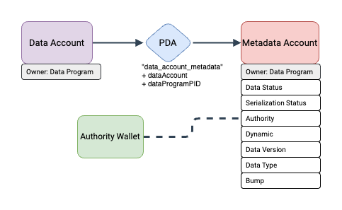

# Solana Data Program V0

Solana Data Program is a program that allows users to initialize a _data account_, read and modify its data, and optionally finalize it.

## ✨ Key Features

- Allows System owned accounts to create (if not done already) and initialize a _data account_ and _metadata account_ that is linked to the `authority` (but owned by the Data Program) to store data of any format (JSON, IMG, HTML, Custom, etc.)
- Allows the `authority` of the _data account_ to modify the `data_type` and/or `data`
- Optionally allows _data account_ to be dynamic i.e., [`realloc`](https://docs.rs/solana-sdk/latest/solana_sdk/account_info/struct.AccountInfo.html#method.realloc)'s the _data account_ on every update instruction to ensure no additional storage is wasted
- Allows the `authority` to update the data starting at a particular offset
- Allows the `authority` to verify that the `data` is of the same data type as expected by the `data_type` field by passing in a `verify_flag: bool`
- Allows the `authority` to update the `authority` field but requires the new authority to also be a signer so that there is no accidental authority transfer
- Allows the `authority` to finalize the data in the _data account_ - finalized data can no longer be updated
- Allows the `authority` to close both the _data account_ and _metadata account_ to reclaim SOL

## Account Overview

### 📄 Metadata PDA Account

The Metadata PDA Account stores information about the `data account`. It is created and initialized by `InitializeDataAccount` and is updated by all other instructions.

| Field                  | Offset | Size | Description                                                                                                                 |
| ---------------------- | ------ | ---- | --------------------------------------------------------------------------------------------------------------------------- |
| `data_status`          | 0      | 1    | Status of the data. Initially set to `INITIALIZED`. `FinalizeDataAccount` sets this to `FINALIZED`.                         |
| `serialization_status` | 1      | 1    | Status of the data serialization. Initially set to `UNVERIFIED`. `UpdateDataAccount` with a set `verify_flag` updates this. |
| `authority`            | 2      | 32   | `PubKey` of the authority of the data account.                                                                              |
| `is_dynamic`           | 34     | 1    | `bool` to determine if the data account is dynamic (can realloc) or static. Set initially via `InitializeDataAccount`.      |
| `data_version`         | 35     | 1    | `u8` to keep track of the version of the Data Program used.                                                                 |
| `data_type`            | 36     | 1    | `u8` to store the Data Type of the data.                                                                                    |
| `bump_seed`            | 37     | 1    | `u8` to store the bump seed.                                                                                                |

### 📄 Data Account

The Data Account stores the data as a raw data byte array.

| Field  | Offset | Size | Description                           |
| ------ | ------ | ---- | ------------------------------------- |
| `data` | 0      | ~    | The data to be stored in the account. |

## Instruction Overview

### 📄 `InitializeDataAccount`

This instruction creates and initializes the Metadata PDA Account and optionally creates a Data Account.

<details>
  <summary>Accounts</summary>

| Name             | Writable | Signer | Description                                                                                    |
| ---------------- | :------: | :----: | ---------------------------------------------------------------------------------------------- |
| `feepayer`       |    ✅    |   ✅   | Payer of the transaction.                                                                      |
| `data`           |    ✅    |   ✅   | The account that will contain the data. Can be created prior to this instruction.              |
| `pda`            |    ✅    |        | The PDA account that will be created and initialized by this instruction to hold the metadata. |
| `system_program` |          |        | The Solana System Program ID.                                                                  |

</details>

<details>
  <summary>Arguments</summary>

| Argument     | Offset | Size | Description                                                                                                                        |
| ------------ | ------ | ---- | ---------------------------------------------------------------------------------------------------------------------------------- |
| `authority`  | 0      | 32   | The `PubKey` of the data account authority.                                                                                        |
| `space`      | 32     | 64   | The initial space taken by the data account. If the data account is created prior to this instruction, this value will be ignored. |
| `is_dynamic` | 96     | 1    | The flag that sets the data account to be dynamic or static. A dynamic data account can realloc up or down.                        |
| `is_created` | 97     | 1    | The flag that determines whether the data account would need to be created in this instruction.                                    |
| `debug`      | 98     | 1    | The flag that determines whether the instruction should output debug logs.                                                         |

</details>

### 📄 `UpdateDataAccount`

This instruction updates the `data_type` field in the Metadata PDA Account and the data in the Data Account.

<details>
  <summary>Accounts</summary>

| Name             | Writable | Signer | Description                                 |
| ---------------- | :------: | :----: | ------------------------------------------- |
| `authority`      |    ✅    |   ✅   | The Authority of the Data Account.          |
| `data`           |    ✅    |        | The account that contains the data.         |
| `pda`            |    ✅    |        | The PDA account that contains the metadata. |
| `system_program` |          |        | The Solana System Program ID.               |

</details>

<details>
  <summary>Arguments</summary>

| Argument       | Offset | Size | Description                                                                                                                                                                                                                                                                     |
| -------------- | ------ | ---- | ------------------------------------------------------------------------------------------------------------------------------------------------------------------------------------------------------------------------------------------------------------------------------- |
| `data_type`    | 0      | 1    | The data type of the `data`.                                                                                                                                                                                                                                                    |
| `data`         | 1      | ~    | The new data (stored as `Vec<u8>`) to be written. **Note:** since the `data` field is an array of variable length, the byte position of any field that follows cannot be guaranteed.                                                                                            |
| `offset`       | ~      | 64   | The offset from where to start writing the new data.                                                                                                                                                                                                                            |
| `realloc_down` | ~      | 1    | The flag that determines whether the data account should realloc down if the writing of the new data leads to unused space. This value is ignored if the data account is static.                                                                                                |
| `verify_flag`  | ~      | 1    | The flag that determines whether the data should be verified that it conforms to its `data_type`. If the data type can be verified, the `serialization_status` will be set to `VERIFIED` or `FAILED` depending on the verification result. Otherwise it is set to `UNVERIFIED`. |
| `debug`        | ~      | 1    | The flag that determines whether the instruction should output debug logs.                                                                                                                                                                                                      |

</details>

### 📄 `UpdateDataAccountAuthority`

This instruction updates the `authority` of the Data Account by updating the value in the Metadata PDA Account. It requires both the old and new authority to be signers to prevent accidental transfers

<details>
  <summary>Accounts</summary>

| Name            | Writable | Signer | Description                                 |
| --------------- | :------: | :----: | ------------------------------------------- |
| `old_authority` |          |   ✅   | The old Authority of the Data Account.      |
| `data`          |          |        | The account that contains the data.         |
| `pda`           |    ✅    |        | The PDA account that contains the metadata. |
| `new_authority` |          |   ✅   | The new Authority of the Data Account.      |

</details>

<details>
  <summary>Arguments</summary>

| Argument | Offset | Size | Description                                                                |
| -------- | ------ | ---- | -------------------------------------------------------------------------- |
| `debug`  | 0      | 1    | The flag that determines whether the instruction should output debug logs. |

</details>

### 📄 `FinalizeDataAccount`

This instruction finalizes the data in the Data Account by setting the `data_status` in the Metadata PDA Account to be `FINALIZED`. Finalized data can no longer be updated.

<details>
  <summary>Accounts</summary>

| Name        | Writable | Signer | Description                                 |
| ----------- | :------: | :----: | ------------------------------------------- |
| `authority` |          |   ✅   | The Authority of the Data Account.          |
| `data`      |          |        | The account that contains the data.         |
| `pda`       |    ✅    |        | The PDA account that contains the metadata. |

</details>

<details>
  <summary>Arguments</summary>

| Argument | Offset | Size | Description                                                                |
| -------- | ------ | ---- | -------------------------------------------------------------------------- |
| `debug`  | 0      | 1    | The flag that determines whether the instruction should output debug logs. |

</details>

### 📄 `CloseDataAccount`

This instruction closes the Data Account and the Metadata PDA Account and transfers the lamports to the `authority`.

<details>
  <summary>Accounts</summary>

| Name        | Writable | Signer | Description                                 |
| ----------- | :------: | :----: | ------------------------------------------- |
| `authority` |    ✅    |   ✅   | The Authority of the Data Account.          |
| `data`      |    ✅    |        | The account that contains the data.         |
| `pda`       |    ✅    |        | The PDA account that contains the metadata. |

</details>

<details>
  <summary>Arguments</summary>

| Argument | Offset | Size | Description                                                                |
| -------- | ------ | ---- | -------------------------------------------------------------------------- |
| `debug`  | 0      | 1    | The flag that determines whether the instruction should output debug logs. |

</details>

## 🧑‍💻 Getting Started

### Typescript SDK

- Follow the instructions in the `package` directory on how to install and use the [`solana-data-program`](https://www.npmjs.com/package/solana-data-program) SDK
- tl;dr:
  - **Installation**:
    ```shell
    npm i solana-data-program
    ```
  - **Usage**:
    ```javascript
    import { DataProgram } from "solana-data-program";
    ```

### CLI

1. Navigate to the `js` directory and install all dependencies using `npm install`
2. Create a `.env` file and add the following to it:

```
CONNECTION_URL=https://api.devnet.solana.com # if deployed on devnet
AUTHORITY_PRIVATE=<REPLACE WITH PRIVATE KEY OF AUTHORITY WALLET>
```

3. To view details about a Data Account, run:

```
npx ts-node src/index.ts --view --account <REPLACE WITH DATA ACCOUNT PUBKEY>
```

- This displays the parsed metadata and data
- If you want to view the raw metadata and data, include the `--debug` flag

4. To upload a file from your file system, run:

```
npx ts-node src/index.ts --upload <REPLACE WITH FILEPATH>
```

- This creates a new static Data Account, initializes it and uploads the file to the Data Account in chunks
- If you already have an existing Data Account, you can upload to it by including the `--account <REPLACE WITH DATA ACCOUNT PUBKEY>` flag
- If you want the Data Account to be dynamic, include the `--dynamic` flag

## 📈 Flow Diagram



## 🚀 Examples

- The `examples` directory contains example projects that build on top of the Data Program to showcase stuff that can be built using it
- Follow in the instructions in the `examples` README to try them out for yourself! ;)
